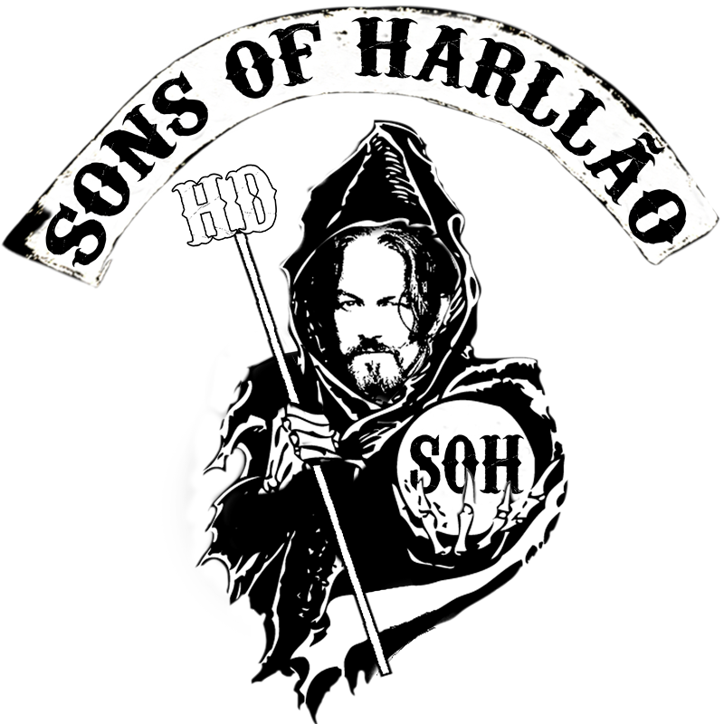

<p align="center">
      
</p>

<h2 align="center" style="font-family: Bahnschrift Condensed; font-size:30px;">👀 PREVIEW</h2>

   <p align="center">
      
   </p>

---

## 📕 Index

- [About](#-about)

- [Technologies](#-technologies)

- [How to download the project](#-how-to-download-the-project)

---

<h2 align="center">About 📖</h2>

<p>
At first the idea of the project was actually used as a blog but it turned out that GraphCMS didn't offer a bad support for formatting all the content of the posts, not giving the possibility to format properly.

The development of this project helped me to learn a lot about TailwindCSS and NextJS so I'm posting it here on Github to use it as a portfolio.

It is also good to emphasize that the project is not my authorship.

Credits to Youtube Channel JavaScript Mastery.

</p>

---

## 🚀 Technologies

- [NextJS](https://nextjs.org/)
- [TailwindCSS](https://tailwindcss.com/)
- [GraphQL](https://graphql.org/)
- [GraphCMS](https://graphcms.com/)

---

<h2 align="center">Functionalities 🛠️</h2>

   <p>
   
- Provider information about Sons of Anarchy's Serie
- Networking

   </p>

---

<h2 align="center">How to Use 🤔</h2>

```
- Clone this repository:
$ git clone https://github.com/harlleybastos/blog-sons-of-harllao.git

- Enter in directory:
$ cd blog-sons-of-harllao

- For install dependencies:
$ yarn install

- Run the app:
$ yarn start
```

---

Developed by Harlley dos Santos Bastos 🚀🖤
